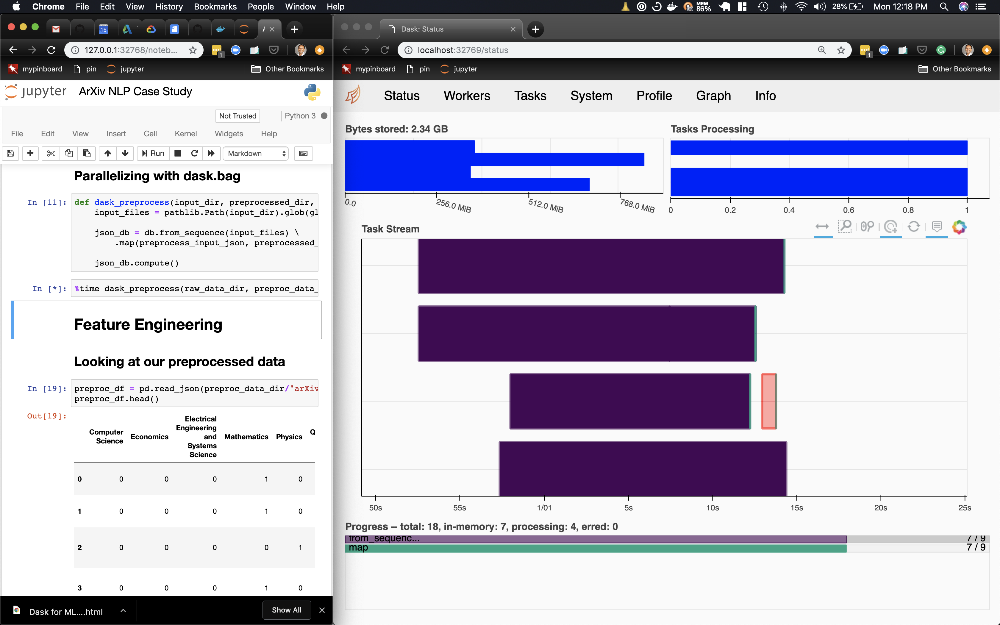

Anacondacon-2019-talk
==============================

Dask for ML Workflows code examples

## 1. Clone this repo

## 2. Launch docker container

### 2a. Pre-requisites

Docker installed on your machine

If you are working on mac, it is recommended to increase the resources the docker-machine gets from the host operating system. The default resource limits can cause memory issues and the ipython kernel may restart during Dask operations. This is easily done through the Docker App GUI interface. See the screenshot below

### 2b. Setup

`./start.sh`

`docker ps` -> should launch an image like below

 
 Note down the PORTS information. We map the default jupyter notebook port 8888 and Dask's dashboard port 8787 to ports on your host machine that can be accessed.

## 3. Notebook

### 3a. Pre-requisites

PORT from `docker ps` output

### 3b. Open notebook server

In your browser go to the following address:

`localhost:<PORT>`

where PORT corresponds to the following value in PORTS:

`127.0.0.1:<PORT>->8888/tcp`, a value near 32768

In the example above, this would be `127.0.0.1:32768->8888/tcp`, so we would go to `localhost:32768`

### 3c. Open notebook

`ArXiv NLP Case Study.ipynb` can be found at the top level in this repo

### 3d. Connect to Dask dashboard

Dask provides a nice dashboard to monitor the cluster. This is usually available on port 8787. We mapped the container's 8787 to a port on the host. The cell with following lines initializes a Dask cluster.
`
cluster = LocalCluster()
client = Client(cluster)
client
`
After your ran that notebook cell you can connect to the dashboard page by going to 

`localhost:<PORT>/status`

where PORT corresponds to the following value in PORTS:

`127.0.0.1:<PORT>->8787/tcp`, a value near 32768

In the example above, this would be `127.0.0.1:32769->8787/tcp`, so we would go to `localhost:32769/status`

When you are executing a dask operation,  the dashboard may look like below which provides information on running tasks and memory usage:

